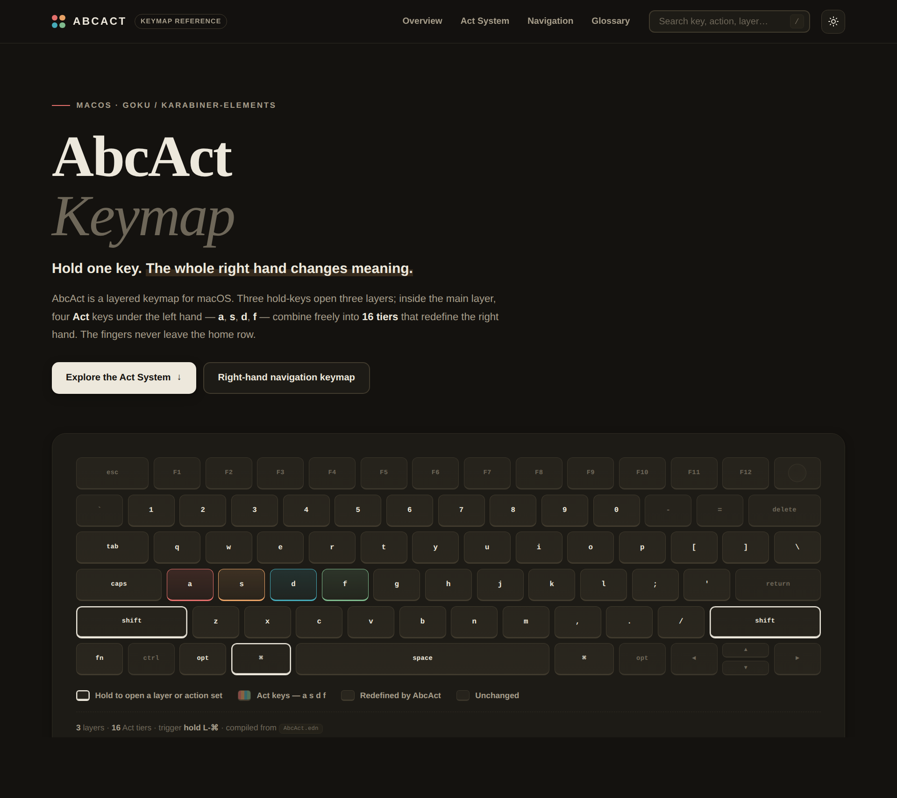
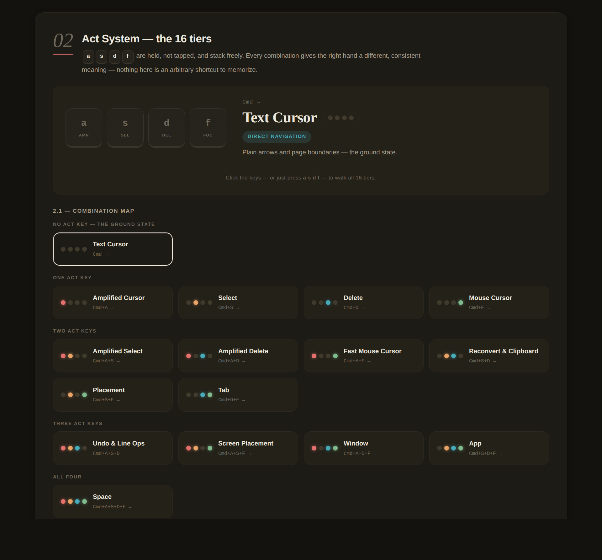

# goku-karabiner-config

Goku (Karabiner-Elements) keymap configurations for macOS. This repository doubles
as a backup of the configuration in active use and an archive of past drafts.

<a href="https://soh-arch.github.io/goku-karabiner-config/">
  
</a>

### [📖 Read the manual →](https://soh-arch.github.io/goku-karabiner-config/)

## The Act system

**Hold one key. The whole right hand changes meaning.**

Three hold-keys open three layers. Inside the main layer, four Act keys under the
left hand — `a` `s` `d` `f` — are held, not tapped, and stack freely into 16 tiers
that each give the right hand a different, consistent meaning. The fingers never
leave the home row.

<a href="https://soh-arch.github.io/goku-karabiner-config/#act">
  
</a>

## Documentation

- **[Reference manual](https://soh-arch.github.io/goku-karabiner-config/)** (English)
  — illustrated and searchable, with an interactive explorer for all 16 tiers.
  Published via GitHub Pages; the source is the single self-contained file
  [`docs/index.html`](./docs/index.html).
- **[`MANUAL.md`](./MANUAL.md)** (Japanese) — the same reference in plain Markdown.
- **[`NOTES.md`](./NOTES.md)** (English) — the Karabiner/Goku gotchas found while
  building this config: why multi-entry `to` arrays can't hold a modifier, why only
  the first matching manipulator fires, why `select_input_source` was abandoned for
  Japanese input, and more. Written for my future self, but most of it applies to
  any Goku setup.

## Keymaps

| File | Status | Notes |
| --- | --- | --- |
| [`AbcAct.edn`](./AbcAct.edn) | **Active** | Currently symlinked to `~/.config/karabiner.edn` and in daily use. Asterisk / Bra / Cket layer system with an Act-key axis. |
| [`HySCOT.edn`](./HySCOT.edn) | Archived draft | SCOT Matrix layout (Shift/Cmd/Opt/Ctrl priority rows on the right hand). |
| [`HyMeCO.edn`](./HyMeCO.edn) | Archived draft | Hyper/Meh two-tier layer system with semicolon/quote/slash sub-layers. |

## Usage

1. Install [Karabiner-Elements](https://karabiner-elements.pqrs.org/) and [Goku](https://github.com/yqrashawn/GokuRakuJoudo).
2. Make sure Karabiner has a profile named `Default` — Goku writes into that
   one unless a config names another, and `AbcAct.edn` doesn't. With a
   renamed or multi-profile setup, `goku` succeeds and nothing changes.
3. Symlink the active file (`AbcAct.edn`) to `~/.config/karabiner.edn`.
4. Run `goku` to compile it into a Karabiner-Elements complex modification.

```bash
ln -s /path/to/AbcAct.edn ~/.config/karabiner.edn
goku
```

## Contributing

Forking and referencing this configuration is welcome. That said, this is a
personal, individually-tuned setup rather than a general-purpose project, so
Issues and Pull Requests may not receive a response.

## License

[MIT](./LICENSE) — fork, adapt, and reuse freely.
